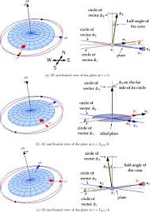

= Explain FP like Richard Feynman

Mateusz Kubuszok

== Richard Feynman

[width="100",cols="1,2"]
|====================
a| image::img/bongos.jpg[Feynman on bongos] a| [%step]
* worked at Los Alamos on https://en.wikipedia.org/wiki/Manhattan_Project[the Manhattan Project]
* discovered https://en.wikipedia.org/wiki/Feynman_diagram[Feynman diagrams]
* investigated https://en.wikipedia.org/wiki/Space_Shuttle_Challenger_disaster[the Challanger disaster]
* a curious and interesting guy
|====================

[NOTE.speaker]
--
The Manhattan project - creation of a nuclear bomb

Feynman diagrams - shows interaction between subatomic particles

_Sure, you're jocking, mr. Feynman!_ - recommend

Image sources:

* https://magazine.caltech.edu/post/feynman-at-100 - bongos
--

== Some serious pics to contrast with Feynman playing a bongo

[width="100%"]
|====================
a| image::img/nuclear.jpg[Nuclear explosion in Los Alamos] a| image::img/diagram.svg[Feynman diagram] a| image::img/challenger.jpg[Challenger disaster]
|====================

[NOTE.speaker]
--
Image sources:

* https://www.atomicheritage.org/history-page-type/los-alamos-innovations - nuclear
* https://en.wikipedia.org/wiki/Feynman_diagram#/media/File:Feynmann_Diagram_Gluon_Radiation.svg - diagram
* https://www.nhpr.org/post/30-years-ago-challenger-disaster-devastated-new-hampshire-and-nation#stream/0 - Challenger
--

== Feynman diagrams

[NOTE.speaker]
--
Story how he got burned out. He freaked out about the expectations of him. Bob Wilson - chief of laboratory, said that he is doing good work as a teacher and as a scientists he can chill out.

Guy at the cafeteria throw a plate - it wobbles and rotates (Feynman sees the medallion of Cornell).

He decided to calculate the ratio and found out it was 1 to 2 (in book it was reversed).

After that he decided to apply similar things to electrons' movement in relativity, then "Dirac Equation then quantum electrodynamics".

Other anegdotes: Stanisław Ulam had uncle Michał Ulam, who was a gambler and visited Monte Carlo a lot. Ulam at some point wanted to calculate the probability of finishing solitare. Von Neumann decided to use it on ENIAC to improve the speed of reaseach in Los Alamos.

Image sources:

* https://aapt.scitation.org/doi/10.1119/1.2402156 - plate
--

[%notitle]
=== Keep it fun

[width="100%"]
|====================
a| image::img/dance.jpg[Feynman dancing] a| image::img/painting.jpg[Feynman's painting]
|====================

[NOTE.speaker]
--
Programming and learning should be fun.

Mention about https://www.youtube.com/watch?v=Pb5oIIPO62g[John Cleese video about creativity]

It doesn't have to be practical.

Mention about https://www.maa.org/external_archive/devlin/LockhartsLament.pdf[Mathematician's lament] FP does not have to be practical, it has to be fun and satisfying

Image sources:

* http://caltech.discoverygarden.ca/islandora/object/ct1%3A543 - dance
* https://www.brainpickings.org/2013/01/17/richard-feynman-ofey-sketches-drawings/ - drawing
--

== Reviewing student's books

|====================
| [small]#Type of energy# | [small]#Description#
| [small]#Mechanical# | [small]#the sum of macroscopic translational and rotational kinetic and potential energies#
| [small]#Electric# | [small]#potential energy due to or stored in electric fields#
| [small]#Magnetic# | [small]#potential energy due to or stored in magnetic fields#
| [small]#Gravitational# | [small]#potential energy due to or stored in gravitational fields#
| [small]#Chemical# | [small]#potential energy due to chemical bonds#
| [small]#Ionization# | [small]#potential energy that binds an electron to its atom or molecule#
| [small]#Nuclear# | [small]#potential energy that binds nucleons to form the atomic nucleus (and nuclear reactions)#
| [small]#Chromodynamic# | [small]#potential energy that binds quarks to form hadrons#
| [small]#Elastic# | [small]#potential energy due to the deformation of a material (or its container) exhibiting a restorative force#
| [small]#Mechanical wave# | [small]#kinetic and potential energy in an elastic material due to a propagated deformational wave#
| [small]#Sound wave# | [small]#kinetic and potential energy in a fluid due to a sound propagated wave (a particular form of mechanical wave)#
| [small]#Radiant# | [small]#potential energy stored in the fields of propagated by electromagnetic radiation, including light#
| [small]#Rest# | [small]#potential energy due to an object's rest mass#
| [small]#Thermal# | [small]#kinetic energy of the microscopic motion of particles, a form of disordered equivalent of mechanical energy#
|====================

[NOTE.speaker]
--
Story about reviewing books. How it uses energy definition instead of explaining that the sun powers plants, plants are part of ecosystem etc.

Also new math. How we force high-level definitions on people without giving them any solid foundations.

Mention https://www.youtube.com/watch?v=UIKGV2cTgqA[Tom Lehrer and his song].
--

[%notitle]
=== Order of explanation

[%step]
* don't explain things you try to explain using (even indirectly) things you want to explain
* abstraction is derived from specifics - not the other way round

== Question about magnets

TODO: images

[NOTE.speaker]
--
https://www.youtube.com/watch?v=4zZbX_9ru9U[Interviewer asked about how magnets work].

Feynman described, how the answer depends on the framework of knowledge of asking side (normal person - magnetic force repels or attracts, physics student - electrons have a charge which can attract or repel depending on how they spin, more advanced explanation cannot refer to "things that the interviewer is familiar with".
--

[%notitle]
=== Adjust the message to audience

[%step]
* not everyone has a CS background
* not everyone has any mathematical background
* if we want to teach someone a formal definition, we need to make sure they know the whole foundation they need before - and that takes time to adjust
